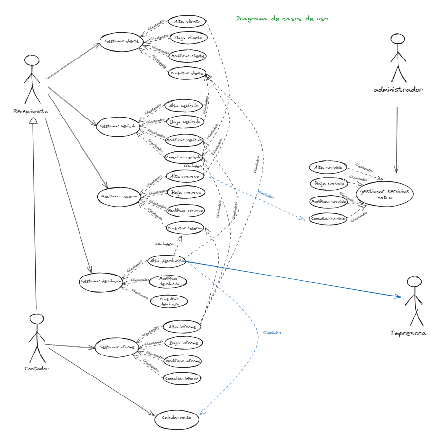
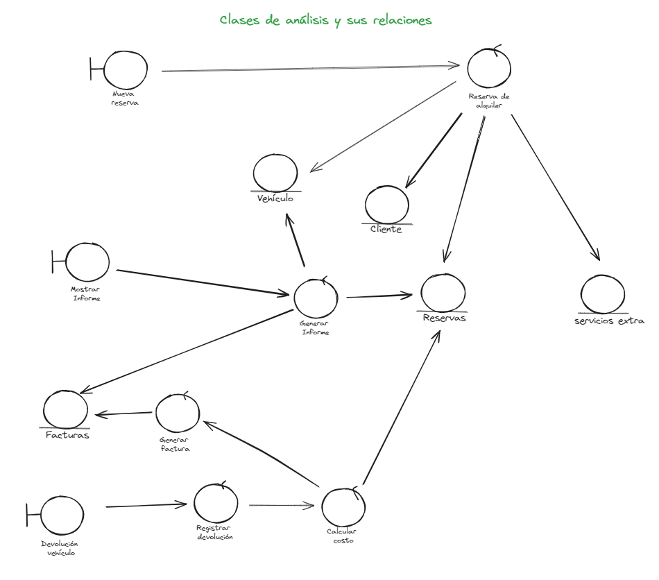
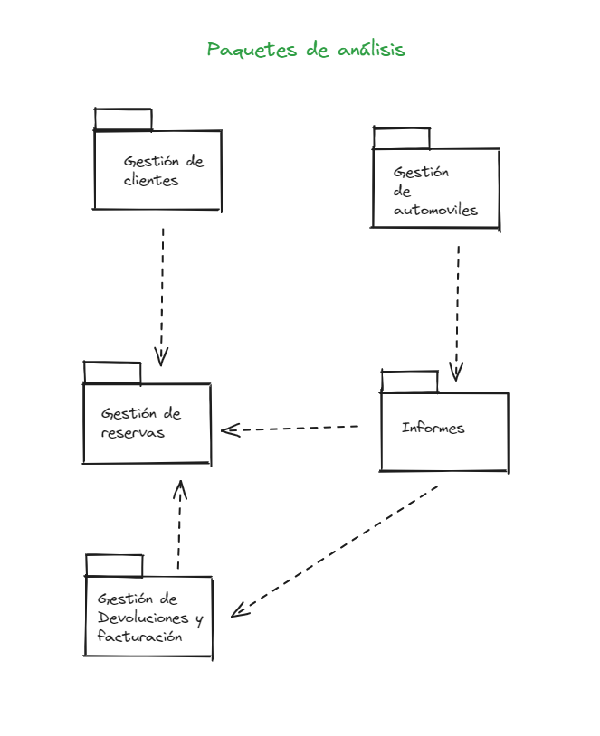

# TP 5 - Ingeniería del software 1
Tema: Análisis de sistemas (Unidad 5)
**Alumnos:**
- Camargo, Amir
- Jiance, Kiara
- Melero, Tania
- Morales, Juan
- Sebestyen, Kiara

**Diagrama de casos de uso:**

**Clases de análisis**:

## **Atributos y métodos:**
### **Gestion reservas:**

- ListarReservas()
- MostrarFormulario()

### **Control reservas:**

- ListaReservas
- AgregarReserva()
- BorrarReserva()
- ModificarReserva()
- ListarReserva()

### **Reservas:**

- fechaInicio
- fechaFin
- cliente
- vehículo
- serviciosExtra
- estadoReserva
- fechaReserva

### **Gestion cliente:**

- ListarClientes()
- FormularioClientes()

### **Control cliente:**

- ListaClientes
- AgregarCliente()
- BorrarCliente()
- ModificarCliente()
- ListarCliente()

### **Cliente:**

- nombre
- direccion
- teléfono
- email

### **Gestión vehículo:**

- listarVehiculos()
- FormularioVehiculos()

### **Control vehículo:**

- ListaVehiculos
- AgregarVehiculo()
- BorrarVehiculo()
- ModificarVehiculo()
- ListarVehiculo()

### **Vehículo:**

- marca
- modelo
- año
- matrícula

### **Gestión de servicio:**

- AgregarServicio()
- BorrarServicio()
- ModificarServicio()
- ConsultarServicio()

### **Control servicios:**

- ListarServiciosExtra()
- AgregarServiciosExtra()
- BorrarServicioExtra()
- ModificarServicioExtra()

### **Servicios extra:**

- nombre
- descripción

### **Facturas:**

- cliente
- fecha
- precio
- servicios

### **Generar factura:**

- ListaFacturas

### **Registrar devolución:**

- ListaDeReservas
- CalcularCosto()
- ModificarVehiculo()

### **Mostrar Informe:**

- MostrarInforme()

### **Generar Informe:**

- ConsultarFacturas()
- ConsultarReservas()
- ConsultarVehiculos()

**Paquetes de análisis**:

### REALIZACIONES DE CASOS DE USO:
### Gestionar reservas
- Gestión reservas (interfaz)
- Control reservas (control)
- Reservas (entidad)

---
### Gestionar clientes
- Gestión cliente (interfaz)
- Control cliente (control)
- Cliente (entidad)

---

### Gestionar vehículos
- Gestión vehículo (interfaz)
- Control vehículo (control)
- Vehículo (entidad)

---

### Generar informe
- Mostrar informe (interfaz)
- Generar informe (control)
- Vehículo (entidad)
- Reservas (entidad)
- Facturas (entidad)

---

### Gestionar servicios extra
- Gestión servicios (interfaz)
- Control servicios (control)
- Servicios extra (entidad)

---

### Gestionar devolucion
- Devolución vehículo (interfaz)
- Registrar devolución (control)
- Reservas (entidad)
- Generar factura (control)
- Facturas (entidad)
- Vehículo (entidad)

---
