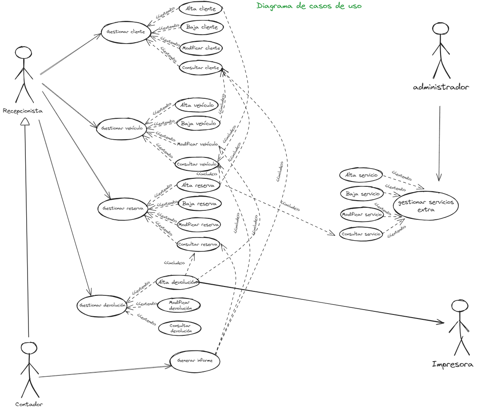
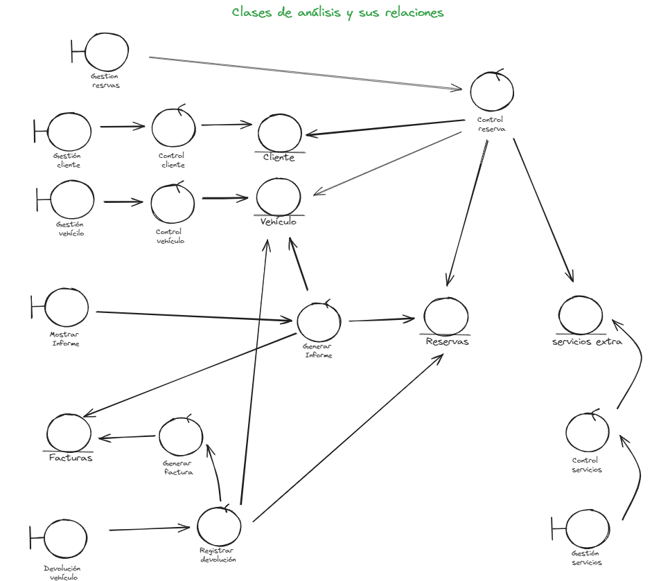

# TP 5 - Ingeniería del software 1
Tema: Análisis de sistemas (Unidad 5)
**Alumnos:**
- Camargo, Amir
- Jiance, Kiara
- Melero, Tania
- Morales, Juan
- Sebestyen, Kiara

**Diagrama de casos de uso:**

**Clases de análisis**:

**Paquetes de análisis**:

### REALIZACIONES DE CASOS DE USO:
1. Gestionar Vehículo (alta, baja, modificación, consulta)

- Interfaz registrar vehículos (Interfaz): Pantalla o ventana que permite ingresar los datos para la creación de los vehículos.
- Controlador de vehículos (Control): Encargado de la creación, localización, modificación, eliminación y consultas de los vehículos.
- Vehículo (Entidad): Contiene la información persistente de los vehículos del sistema.

---

2. Gestionar Cliente (alta, baja, modificación, consulta)

- Interfaz registrar cliente (Interfaz): Pantalla o ventana que permite ingresar los datos para la creación de los clientes.
- Controlador de clientes (Control): Encargado de la creación, localización, modificación, eliminación y consultas de los clientes.
- Cliente (Entidad): Contiene la información persistente de los clientes del sistema.

---

3. Gestionar Reserva (alta, baja, modificación, consulta)

- Interfaz registrar reserva (Interfaz): Pantalla o ventana que permite ingresar los datos para la creación de las reservas.
- Controlador de reservas (Control): Encargado de la creación, localización, modificación, eliminación y consultas de las reservas.
- Reserva (Entidad): Contiene la información persistente de las reservas del sistema.
- Vehículo (Entidad): Contiene la información persistente de los vehículos del sistema.
- Cliente (Entidad): Contiene la información persistente de los clientes del sistema.

---

4. Gestionar Devolución (alta, baja, modificación, consulta)

- Interfaz registrar devolución (Interfaz): Pantalla o ventana que permite ingresar los datos para la creación de las devoluciones.
- Controlador de devoluciones (Control): Encargado de la creación, localización, modificación, eliminación y consultas de las devoluciones.
- Reserva (Entidad): Contiene la información persistente de las reservas del sistema.
- Vehículo (Entidad): Contiene la información persistente de los vehículos del sistema.
- Cliente (Entidad): Contiene la información persistente de los clientes del sistema.

---

5. Gestionar Informes

- Reserva (Entidad): Contiene la información persistente de las reservas del sistema.
- Vehículo (Entidad): Contiene la información persistente de los vehículos del sistema.
- Cliente (Entidad): Contiene la información persistente de los clientes del sistema.

---

6. Gestionar Servicios Extra

- Interfaz gestionar servicios extra (Interfaz): Pantalla o ventana que permite gestionar servicios adicionales como seguro, silla de bebé, etc.
- Controlador de servicios extra (Control): Encargado de la creación, localización, modificación, eliminación y consultas de los servicios extra.
- Servicios Extra (Entidad): Contiene la información persistente de los servicios extra del sistema.

---

7. Calcular Costo

- Interfaz calcular costo (Interfaz): Pantalla o ventana que permite calcular el costo total del alquiler basado en los días, tipo de vehículo y servicios adicionales.
- Controlador de costo (Control): Encargado de la lógica de cálculo de costos del alquiler.
